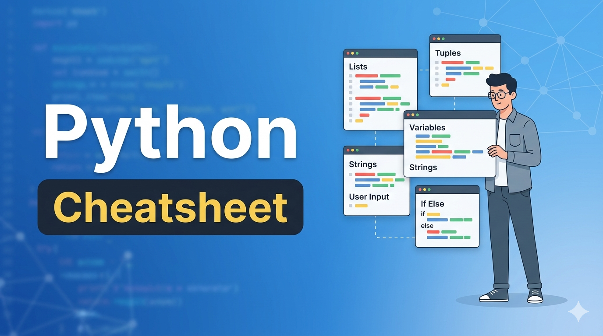

<br>
<br>
<br>
<br>
<br>
<br>
<br>
<br>

# Advanced Python Playbook

Practical Techniques Used in Real Systems

> A curated reference of modern Python capabilities every serious developer should understand.




<p align = "right"><b>Written By</b>: <i>Tanu Nanda Prabhu</i></p>


<br>
<br>
<br>
<br>
<br>
<br>
<br>
<br>
<br>
<br>

# 1. List Comprehensions

Compact syntax for generating lists efficiently.

## Example

```python
squares = [x**2 for x in range(6)]
print(squares)
```

## Output

```json
[0, 1, 4, 9, 16, 25]
```

## Conditional Example

```python
even_numbers = [x for x in range(10) if x % 2 == 0]
print(even_numbers)
```

## Output

```json
[0, 2, 4, 6, 8]
```


---

# 2. Generators

> Produce values lazily instead of storing them in memory.

## Example

```python
def count_up(n):
    for i in range(n):
        yield i

for value in count_up(5):
    print(value)
```

<br>
<br>

## Output

```json
0
1
2
3
4
```

## Benefits

| Advantage        | Description                |
|:--------------- | :---------------------- |
| Memory Efficient | Generates values on demand |
| Faster Pipelines | Ideal for streaming data   |
| Clean Iteration  | Works naturally with loops |


---

# 3. Decorators

> Extend funtion behaviour without modifying original code.

## Example

```python
def logger(func):
    def wrapper():
        print("Execution started")
        func()
        print("Execution finished")
    return wrapper

@logger
def greet():
    print("Hello Python")

greet()
```

## Output

```json
Execution started
Hello Python
Execution finished
```

---

# 4. Lambda Functions

> Short anonymous functions useful for quick operations.

## Example

```python
add = lambda a, b: a + b
print(add(5, 3))
```

## Output

```json
8
```

## Sorting Example

```python
data = [(1,3), (2,1), (4,2)]

data.sort(key=lambda x: x[1])
print(data)
```

## Output

```json
[(2, 1), (4, 2), (1, 3)]
```

---

# 5. Context Managers

> Automatically handle resource managment.

## Example

```python
with open("file.txt", "w") as f:
    f.write("Hello Python")
```

<br>
<br>
<br>

## Why It Matters

| Problem        | Solution         |
|:-------------- |:---------------- |
| File left open | Auto closing     |
| Memory leaks   | Resource cleanup |
| Boilerplate    | Cleaner syntax   |

---


# 6. Dataclasses

> Reduce boilerplate when creating data containers.

## Example

```python
from dataclasses import dataclass

@dataclass
class User:
    name: str
    age: int

user = User("Alice", 25)

print(user)
```


## Output

```json
User(name='Alice', age=25)
```


---

# 7. Enumerations

> Define named constants for better readability.

## Example

```python
from enum import Enum

class Status(Enum):
    SUCCESS = 1
    FAILED = 2
    PENDING = 3

print(Status.SUCCESS)
```

## Output

```json
Status.SUCCESS
```

---

# 8. Multiprocessing

> Use multiple CPU cores to speed up tasks.

## Example

```python
from multiprocessing import Process

def task():
    print("Process executing")

p = Process(target=task)

p.start()
p.join()
```

## Output

```json
Process executing
```

---

# 9. Caching with lru_cache

> Optimize expensive recursive operations.

## Example

```python
from functools import lru_cache

@lru_cache(maxsize=None)
def fibonacci(n):
    if n < 2:
        return n
    return fibonacci(n-1) + fibonacci(n-2)

print(fibonacci(10))
```

## Output

```json
55
```

---

## 10. Flexible Arguments

> Handle variable funtion inputs.

## Example

```python
def example(*args, **kwargs):
    print(args)
    print(kwargs)

example(1, 2, 3, name="Alice", age=25)
```

## Output

```json
(1, 2, 3)
{'name': 'Alice', 'age': 25}
```


---

# Real World Applications

| Domain                   | Usage               |
| :------------------------ | :------------------ |
| Backend Development      | Decorators, caching |
| Data Engineering         | Generators          |
| Automation               | Flexible arguments  |
| APIs                     | Dataclasses         |
| High Performance Systems | Multiprocessing     |

---

<br>
<br>

# Key Takeaways

- Python offers powerful abstractions for writing clean code.
- Advanced concepts drastically improve performance and maintainability.
- Mastery of these patterns separates intermediate developers from experts.

---

