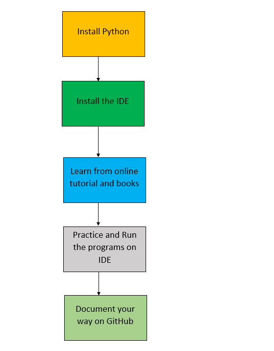
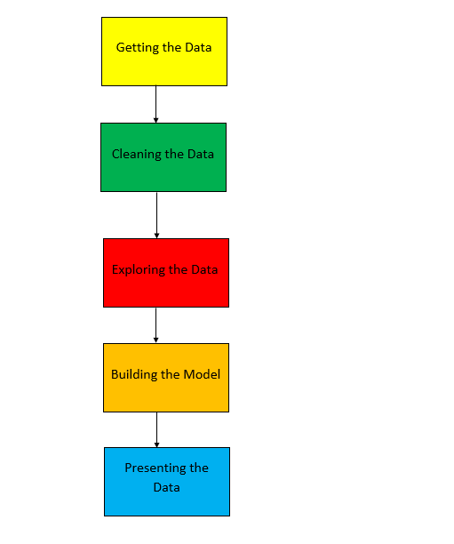

# This Repository Helps You Understand Python Programming Language From Beginner To Advance Level.

<h3 align = "justify"> Also this repository gives to enough knowledge about python programming and also helps you to survive in this programming world !!! </h3>

# Installation tools

| Name of the tools | 
| ------------- |
|[Python download](https://www.python.org/downloads/)|
|[Pycharm download](https://www.jetbrains.com/pycharm/download/#section=windows)|
|[Jupyter Notebook](https://jupyter.org/install)|
|[Google Colab](https://colab.research.google.com/notebooks/welcome.ipynb)|

 For those of you who aren't aware of Pycharm: PyCharm is an integrated development environment used in computer programming, specifically for the Python language. It is developed by the Czech company JetBrains (Psss, copied from Wikipedia).

I personally use Google Colab for python programming. It's one of the best interactive tool in the world. I like it because I can provide more documentation to the code and write some quality tutorials.

# Repository Contents

This repository is divided into two parts such as Python Coding for Beginners and Data Science.

<b>1) Python Coding</b>

1. <b>[src](https://github.com/Tanu-N-Prabhu/Python/tree/master/Src)</b>
2. <b>[Strings](https://github.com/Tanu-N-Prabhu/Python/tree/master/Strings)</b>
3. <b>[Lists](https://github.com/Tanu-N-Prabhu/Python/tree/master/Lists)</b> 
4. <b>[Tuples](https://github.com/Tanu-N-Prabhu/Python/tree/master/Tuples)</b>
5. <b>[Dictionary](https://github.com/Tanu-N-Prabhu/Python/tree/master/Dictionary%20).</b>
6. <b>[Numpy](https://github.com/Tanu-N-Prabhu/Python/tree/master/Numpy)</b>
7. <b>[Pandas](https://github.com/Tanu-N-Prabhu/Python/tree/master/Pandas)</b>

<b>2) Data Science</b>

1. <b> [Data Scraping from the Web](https://github.com/Tanu-N-Prabhu/Python/tree/master/Data%20Scraping%20from%20the%20Web)</b>
2. <b> [Data Cleaning and Scrubbing](https://github.com/Tanu-N-Prabhu/Python/tree/master/Data_Cleaning)</b>
3. <b> [Exploring the data from the Web](https://github.com/Tanu-N-Prabhu/Python/tree/master/Exploratory%20Data%20Analysis)</b>
4. <b> Predicting the data</b>

<b>If the jupyter notebook doesn't load. Don't worry just copy and paste the link to [nbviewer](https://nbviewer.jupyter.org). Because most of my jupyter notebooks are not loading.</b>

# Contributors

 Tanu Nanda Prabhu : This is me, I'm doing my Master's in Computer Science, at University of Regina, Canada. Although I'm good at programming, definitely not a code monkey. I like to document each and every line of code and help others understand it. It is very important to document the code. I believe that I learn simultaneously while I teach you guys in this repository. Special thanks to Udemy, it is with the help of their guidance, I could learn Python at a high level.

# I am an Author @

1) [Towards Data Science](https://medium.com/@tanunprabhu95)

2) [Analytics-Vidhya](https://medium.com/@tanunprabhu95)

3) [Kotlin Academy](https://medium.com/@tanunprabhu95)

4) [The Start up](https://medium.com/@tanunprabhu95)

# Kaggle

1) [My Kaggle Data Sets](https://www.kaggle.com/tanuprabhu/datasets)

# HackerRank Exercise

1) [HackerRank Exercise Solved](https://github.com/Tanu-N-Prabhu/Python/tree/master/Hacker_Rank_Exercises)

# Submit you articles here

1) [Data Science from Scratch](https://medium.com/data-science-from-scratch)

# Contact for help

| Contact        | Info           | 
| ------------- |:-------------:|
| Mail id      | tanuprabhu96@gmail.com  | 
| Phone number        | +1 306-737-9073              |   
| Facebook       | Tanu N Prabhu      |    
| Instagram      | tanunprabhu   |

<b> Version 3.3 - Last Updated on October 11 2019 - 11:35 PM <b>
