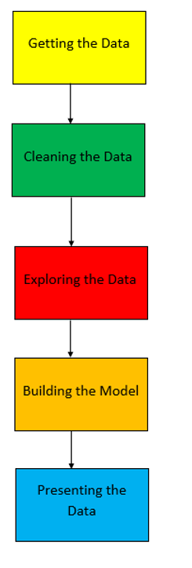

<h1 align = "center">Python Programming Hub</h1>

<h2 align = "center">One of the best places to learn Python and Data Science</h2>

<!-- Shield Badges -->

|   |   |  |  |  | |  |
|:--:|:--:|:--:|:--:|:--:|:--:|:--:|

|  | 
|:--:| 
| Image Credits [Wallpaper Flare](https://www.wallpaperflare.com/programming-is-an-art-text-code-python-computer-python-programming-wallpaper-srfia) |

<h4 align = "justify"> This repository gives to enough knowledge about python programming, data science and also helps you to survive in this programming world !!! </h4>

# Installation tools

#### Below are some tools that you can download before getting started with Python, now it’s a preference, so download whichever that fits the best for you.

| Name of the tools | 
| ------------- |
|[Python download](https://www.python.org/downloads/)|
|[Visual Studio Code](https://code.visualstudio.com/download)|
|[Jupyter Notebook](https://jupyter.org/install)|
|[Google Colab](https://colab.research.google.com/notebooks/welcome.ipynb)|

> I personally use Google Colab for python programming. It's one of the best interactive tool in the world. I like it because I can provide more documentation to the code and write some quality tutorials.

# Repository Contents

### This repository is divided into two parts such as Python Coding and Data Science for Beginners.

# Python Coding

Follow the steps down below to get started coding in python!!!

 

## Pythonic Materials

  
Chapter 1️⃣ ⮕ Basic Concepts

 - <b>[Python Input, Output and Import functions](https://github.com/Tanu-N-Prabhu/Python/blob/master/Python_Input%2C_Output_and_Import.ipynb)</b>
 
 - <b>[Python Variables](https://github.com/Tanu-N-Prabhu/Python/blob/master/Python_Variables.ipynb)</b>
   * <b>[Python Global, Local and Nonlocal Variables](https://github.com/Tanu-N-Prabhu/Python/blob/master/Global%2C_Local_and_Nonlocal_variables_in_Python.ipynb)</b>
   
 - <b>[Python Strings](https://github.com/Tanu-N-Prabhu/Python/tree/master/Strings)</b>
 
 - <b>[Python Lists](https://github.com/Tanu-N-Prabhu/Python/tree/master/Lists)</b> 
 
 - <b>[Python Tuples](https://github.com/Tanu-N-Prabhu/Python/tree/master/Tuples)</b>
 
 -  <b>[Python Dictionary](https://github.com/Tanu-N-Prabhu/Python/tree/master/Dictionary%20)</b>
 
 - <b>[Python Operators](https://github.com/Tanu-N-Prabhu/Python/blob/master/Python_Operators.ipynb)</b>

  
Chapter 2️⃣ ⮕ Built-in Functions

 - <b>[Python Input, Output and Import built-in-functions](https://github.com/Tanu-N-Prabhu/Python/blob/master/Python_Input%2C_Output_and_Import.ipynb)</b>
 
 - <b>[Eval built-in-function](https://github.com/Tanu-N-Prabhu/Python/blob/master/Eval_built_in_function.ipynb)</b>
   
 - <b>[Range built-in-function](https://github.com/Tanu-N-Prabhu/Python/blob/master/Range_built_in_function.ipynb)</b>
 
 - <b>[Python Lambda Function](https://github.com/Tanu-N-Prabhu/Python/blob/master/Python_Lambda_Function.ipynb)</b>
 
 - <b>[Python Enumerate Function](https://github.com/Tanu-N-Prabhu/Python/blob/master/Python_enumerate()_built_in_function.ipynb)</b>
 
 - <b>[Python len function](https://github.com/Tanu-N-Prabhu/Python/blob/master/Python_len()_built_in_function.ipynb)</b>  
 

  
Chapter 3️⃣ ⮕ Libraries

 - <b>[Numpy library](https://github.com/Tanu-N-Prabhu/Python/tree/master/Numpy)</b>
 
 - <b>[Pandas library](https://github.com/Tanu-N-Prabhu/Python/tree/master/Pandas)</b>
   
 - <b>[Math Module](https://github.com/Tanu-N-Prabhu/Python/blob/master/Learn_the_Python_Math_Module.ipynb)</b>
 
 - <b>[JSON library](https://github.com/Tanu-N-Prabhu/Python/blob/master/How_to_handle_JSON_in_Python%3F.ipynb)</b>

  
Chapter 4️⃣ ⮕ API's

 - <b>[Google Translate API for Python](https://github.com/Tanu-N-Prabhu/Python/tree/master/Google%20Translate%20API)</b>
 
 - <b>[Google Trends API for Python](https://github.com/Tanu-N-Prabhu/Python/blob/master/Google_Trends_API.ipynb)</b>
   
 - <b>[Wikipedia API for Python](https://github.com/Tanu-N-Prabhu/Python/blob/master/Wikipedia_API_for_Python.ipynb)</b>
 
 - <b>[Google Search API for Python](https://github.com/Tanu-N-Prabhu/Python/blob/master/The_two_Google_Search_Python_Libraries_you_should_never_miss.ipynb)</b>

  
Chapter 5️⃣ ⮕ Additional Materials

 - <b>[How to get started coding in Python?](https://github.com/Tanu-N-Prabhu/Python/blob/master/How_to_get_started_coding_in_Python%3F.ipynb)</b>
 
 - <b>[Is Python Object Oriented?](https://github.com/Tanu-N-Prabhu/Python/blob/master/Is_Python_object_oriented%3F.ipynb)</b>
 
 - <b>[Speech Recognition using Python](https://github.com/Tanu-N-Prabhu/Python/blob/master/Speech_Recognition_using_Python.ipynb)</b>
 
 - <b>[One-Hot encoding in Python](https://github.com/Tanu-N-Prabhu/Python/blob/master/Learning_One_Hot_Encoding_in_Python_the_Easy_Way.ipynb)</b>
 
 - <b>[Reading An Image In Python (Without Using Special Libraries)](https://github.com/Tanu-N-Prabhu/Python/blob/master/Reading_An_Image_In_Python_(Without_Using_Special_Libraries).ipynb)</b>
 
 - <b>[Rendering Images inside a Pandas DataFrame](https://github.com/Tanu-N-Prabhu/Python/blob/master/Rendering_Images_inside_a_Pandas_DataFrame.ipynb)</b>
 
 - <b>[Using the Pandas Data Frame as a Database](https://github.com/Tanu-N-Prabhu/Python/blob/master/Using_the_Pandas_Data_Frame_as_a_Database_.ipynb)</b>
 
 - <b>[Using the Pandas DataFrame in Day-To-Day Life](https://github.com/Tanu-N-Prabhu/Python/blob/master/Using_the_Pandas_DataFrame_in_Day_To_Day_Life.ipynb)</b>
 
 - <b>[Presenting Python code using RISE](https://github.com/Tanu-N-Prabhu/Python/blob/master/Presenting_Python_code_using_RISE.ipynb)</b>
 
 - <b>[Cheat Sheet for Google Colab](https://github.com/Tanu-N-Prabhu/Python/blob/master/Cheat_sheet_for_Google_Colab.ipynb)</b>
 

  
Chapter 6️⃣ ⮕ Exercises

 - <b>[String Concatenation Questions](https://github.com/Tanu-N-Prabhu/Python/blob/master/String_Concatenation_Exercise_Questions.ipynb)</b>
   * <b>[String Concatenation Answers](https://github.com/Tanu-N-Prabhu/Python/blob/master/String_Concatenation_Exercise_Answers.ipynb)</b>
   
 - <b>[Built-In Functions Exercise Questions](https://github.com/Tanu-N-Prabhu/Python/blob/master/Built_In_Functions_Exercise_Questions.ipynb)</b>
 

  
Chapter 7️⃣ ⮕ Quiz

 - <b>[Quiz - 1](https://github.com/Tanu-N-Prabhu/Python/blob/master/Quiz/Python_Quiz_1.ipynb)</b>
   
 - <b>[Quiz - 2](https://github.com/Tanu-N-Prabhu/Python/blob/master/Quiz/Python_Quiz_2.ipynb)</b>
 
 - <b>[Quiz - 3](https://github.com/Tanu-N-Prabhu/Python/blob/master/Quiz/Python_Quiz_3.ipynb)</b>
 

  
Chapter 8️⃣ ⮕ Interview Preparation

 - <b>[Python Coding Interview Questions (Beginner to Advanced)](https://github.com/Tanu-N-Prabhu/Python/blob/master/Python%20Coding%20Interview%20Prep/Python%20Coding%20Interview%20Questions%20(Beginner%20to%20Advanced).md)</b>
 
 - <b>[35 Python interview questions for experienced](https://github.com/Tanu-N-Prabhu/Python/blob/master/Python%20Coding%20Interview%20Prep/35%20Python%20interview%20questions%20for%20experienced.md)</b>
   

👉 **Expand** and **Collapse** the above Chapters for more details
  
---

  
# Data Science

Follow the steps down below to get started learning Data Science!!!

## Data Science Materials

  
Data Scraping from the Web

 - <b>[Scraping Two YouTube Accounts - PewDiePie vs T-Series](https://github.com/Tanu-N-Prabhu/Python/blob/master/Data%20Scraping%20from%20the%20Web/Scraping%20YouTube%20accounts%20with%20python.ipynb)</b>
 
 - <b>[Scraping Rate My Professor Website - My Graduate Professor](https://github.com/Tanu-N-Prabhu/Python/blob/master/Data%20Scraping%20from%20the%20Web/Web_Scraping_Rate_My_Professor_Website.ipynb)</b>

---
# Nbviewer

<b align = "justify">If the jupyter notebook doesn't load. Don't worry just copy and paste the link to [nbviewer](https://nbviewer.jupyter.org). Because most of my jupyter notebooks are not loading.</b>

---
# Contributors

### Currently there are 10 contributors for this repository. Feel free to contribute!

> Want to know, how I did this. Refer here for the [docs](https://github.com/Tanu-N-Prabhu/myWebsite.io/blob/master/Docs/Displaying%20Contributors%20Image%20on%20README%20files%20with%20no%20Pain!.md)

---

# Kaggle Datasets

1) [Kaggle Data Sets](https://www.kaggle.com/tanuprabhu/datasets)

---

# HackerRank Exercises - Solved

1) [HackerRank Exercise Solved](https://github.com/Tanu-N-Prabhu/Python/tree/master/Hacker_Rank_Exercises)

---

# Reddit Communities

1) [Python](https://www.reddit.com/r/Python/)
2) [Learn python](https://www.reddit.com/r/learnpython/)
3) [Python tips](https://www.reddit.com/r/pythontips/)
4) [Python coding](https://www.reddit.com/r/pythoncoding?utm_medium=android_app&utm_source=share)

---

# Submit your articles here

1) [Data Science from Scratch](https://medium.com/data-science-from-scratch)

---

# Contact for help

| Contact        | Info           | 
| ------------- |:-------------:|
| <b>Gmail</b>      | tanuprabhu96@gmail.com  | 
| <b>Phone number</b>        | +1 306-737-9073              |   
| <b>Facebook</b>       | Tanu N Prabhu      |    
| <b>Instagram </b>    | tanunprabhu   |
| <b>Linkedin </b>    | [Tanu Nanda Prabhu](https://www.linkedin.com/in/tanu-nanda-prabhu-a15a091b5/) |

---

# Reviews

<b>Below given are some of the reviews about this Python GitHub Repository:</b>
 

> <b>‪Elin Uppström</b> - Senior Lecturer at Uppsala University, Sweden.  
> I found your excellent exercises at your GitHub wile preparing undergraduate course in data analysis. I want to use it in my course.

> <b>‪Cole Striler</b> - Data Scientist, Founder of Datafied 
> I came across your GitHub and love your Jupyter Notebooks, especially the one on "<b>Predicting PewDiePie's daily subscribers</b>". I think you do a great job at explaining your work which is something others can learn.

> <b>Laurence Watson</b> - Co-Founder & CEO, Treebeard 
> You have a lot of great Jupyter notebook content on GitHub.

> <b>Poonam Gupta</b> - Math & AP Computer Science Instructor, Brunswick School  
> Thank you so much for posting such helpful posts on GitHub.Many, many thanks for all you do to spread the knowledge.

**Do you like the Repository, Please drop in your precious reviews by shooting an e-mail**.

---

# Feedback

[Any Feedbacks or Suggestions- Please Click Here](https://form.jotform.com/92847563204259)

---

# Version

<b> Version 10.6 - Last Updated on Feb 25 2021 - 12:28 PM <b>
  
  

