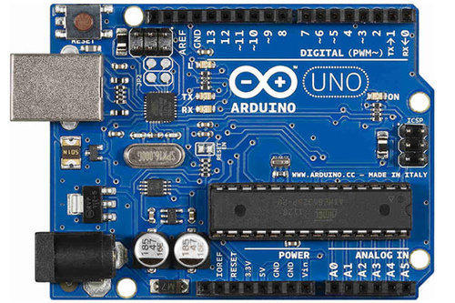
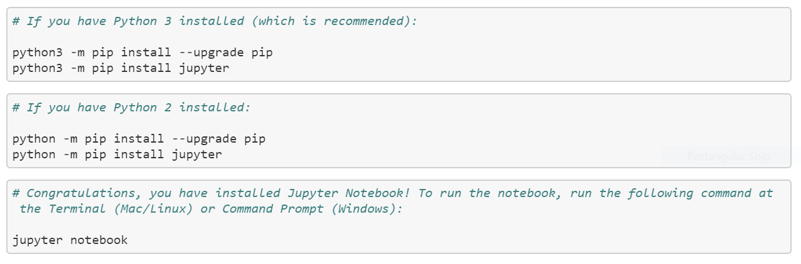

# Learning Python Programming Language from Beginner to Advance.

<h2> Helps to understand Java from beginners to advance. </h2> 
<h3 align = "justify"> This repository gives to enough knowledge about java and also helps you to survive in this programming world !!! </h3>

# Installation
1. Python download: (https://www.python.org/downloads/)
2. Pycharm download: (https://www.jetbrains.com/pycharm/download/#section=windows)
3. Jupyter Notebook: (https://jupyter.org/install)

 Installation commands is visually represented below: Make sure that you type all the below commands in your respected command prompt only.

 For those of you who aren't aware of Pycharm: PyCharm is an integrated development environment used in computer programming, specifically for the Python language. It is developed by the Czech company JetBrains (Psss, copied from Wikipedia).

# Repository Contents

 Each directory inside the src/ directory presents exercises revolving around a particular concept in Python. Not all of these concepts are unique to Python (in fact, most probably aren't). This means that you can leverage knowledge you've obtained via exposure to other programming languages towards learning Python.

The suggested order for going through each of the directories is:

1. __helloWorld__ ==> Printing Hello World
2. __variables__ ==> Creating Variables.
3. __String__ ==> Creating Strings.
4. __Accessing_By_Index__ ==> Accessing a String by Index.
5. __Slicing_A_String__ ==> Slicing a string using Index.
6. __String_Concatenation_Using_Print__ ==> Concatenating a string using print statement.
7. <b>Using_%s_format_operator</b> ==> Using the %s format operator.
8. __Using_input()__ ==> Taking the input and outputting them.
9. __Control_Statements__ ==> Usage of if, elif and else control statements.
10. __Functions__ ==> Creating and using the functions.
11. __List__ ==> Creating list, inserting a list, appending, removing, accesing by index, etc..
12. __Tuples__ ==> Creating, Accessing by Index, and Slicing the tuples.
13. __for_Loops__ ==> Creating for loops.
14. __dictionary__ ==> Creating, calculating the length, reassigning the key, removing the value of the dictionary.
15. __using_functions_with_lists__ ==> Using finctions with lists.
16. __using_list_with_functions_contd__ ==> Using a range function via a for loop to modify a list, passing multiple list to a function.
17. __Using numerical python (numpy)__ ==> different numpy examples, helps you understand about numpy.

    17.1 __Product of two dimensional Matrix using (numpy)__ ==> Just a quick solution to multiply two dimemsional matrix.

18. __Using Pandas Library__ ==> Using different datastrutures of pandas library.

# Contributors

 Tanu Nanda Prabhu : This is me, I'm doing my Master's in Computer Science, at University of Regina, Canada. Although I'm good at programming, definitely not a code monkey. I like to document each and every line of code and help others understand it. It is very important to document the code. I believe that I learn simultaneously while I teach you guys in this repository. Special thanks to Udemy, it is with the help of their guidance, I could learn Python at a high level. All the turorials are referred from their notes.

